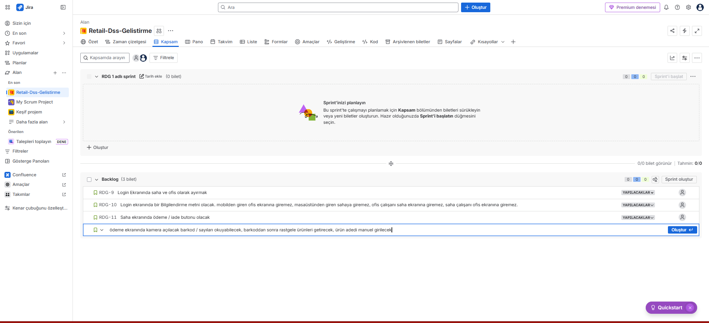
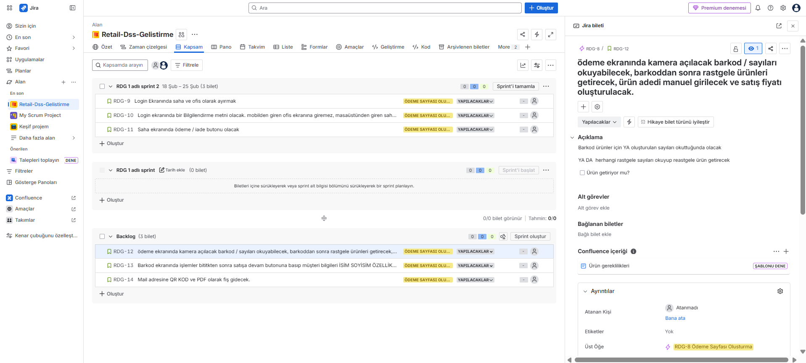
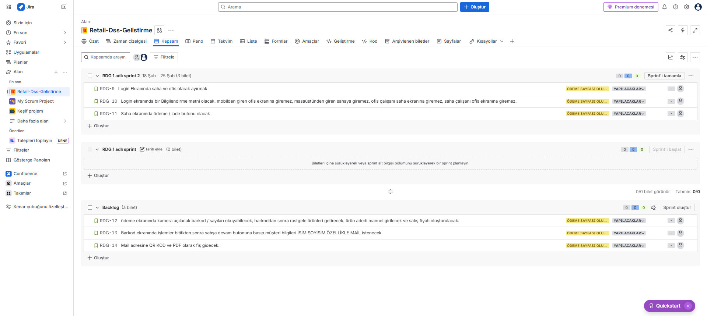

# Kasa Sayfası Projesi
Bitirme projesinin bir adımını jira ile yönettim. Ödeme, Satış, İade ekranı oluşturdum.

## 📸 Sprint Yönetimi & Kanıtlar

### 1. Backlog ve Sprint Planlaması
Kullanıcı hikayeleri (User Stories) oluşturuldu ve önceliklendirildi.

### 2. User Story Detayı ve Kabul Kriterleri
Geliştiriciler için net "Definition of Done" kriterleri belirlendi.
> *"Bir yeni müşteri olarak, zaman kaybetmemek için üye olmadan siparişimi tamamlamak istiyorum."*
 

### 3. Kanban Board (İş Takibi)
Sprint ilerlemesi aktif olarak takip edildi.

---
*Bu proje, İbrahim Türkyılmaz tarafından PM portfolyo çalışması olarak hazırlanmıştır.*
